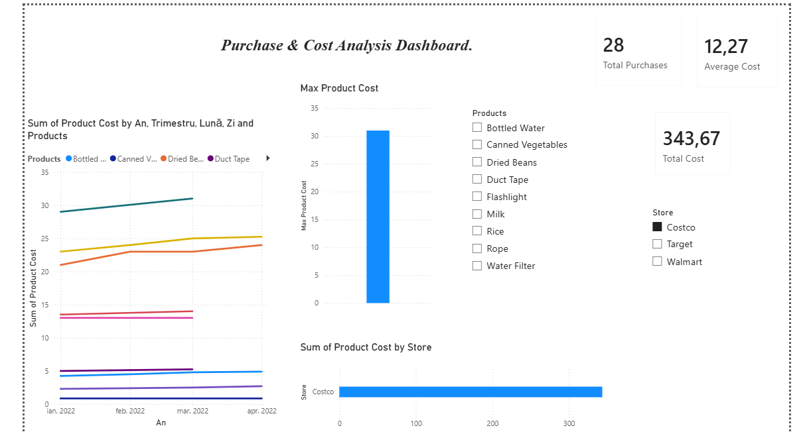
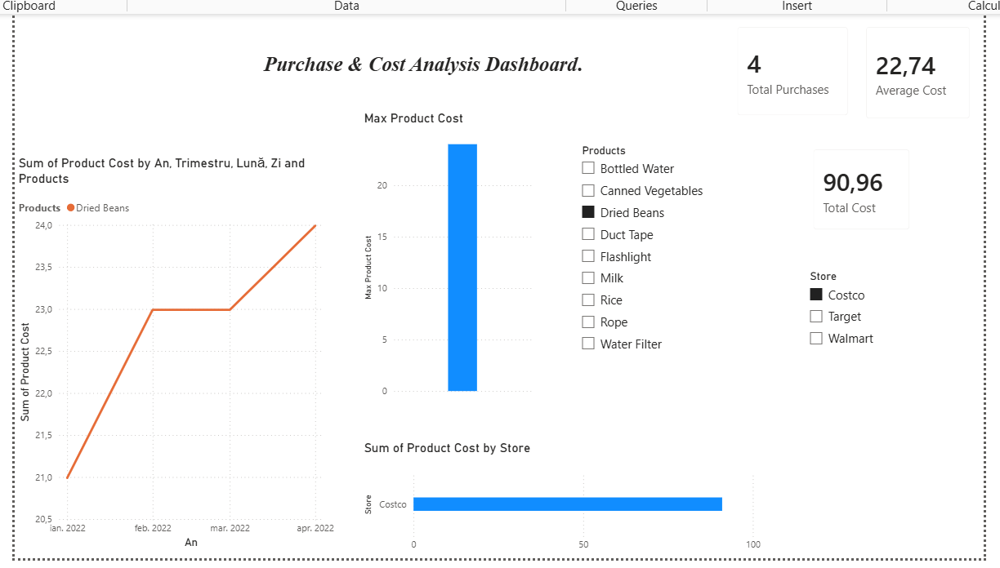

# 📊 Power BI Purchase & Cost Analysis Dashboard

## 📌 Project Overview
This project presents an interactive **Power BI Dashboard** built to analyze store purchases, product cost distributions, and monthly price trends across different retail stores (Costco, Target, Walmart).

The primary objective of this project was to transform raw/pivoted purchase data into a clean, relational data model, implement custom **DAX measures**, and create clear visual analytics for data-driven decision making.

---

## 🛠️ Key Steps & Workflow

1. **Data Cleaning & Normalization (Power Query):**
   - Transformed pivoted monthly columns (`Jan`, `Feb`, `Mar`, `Apr`) into an unpivoted flat-table structure (`Puchase Overview`).
   - Cleaned data types, properly formatted dates, and ensured correct numeric formatting for product costs.

2. **Data Modeling & DAX Measures:**
   - Designed key calculated measures using **DAX (Data Analysis Expressions)**:
     - `Total Cost`: `SUM('Puchase Overview'[Product Cost])`
     - `Average Cost`: `AVERAGE('Puchase Overview'[Product Cost])`
     - `Total Purchases`: `COUNTROWS('Puchase Overview')`

3. **Dashboard Design & Visualizations:**
   - **Key Metrics (KPI Cards):** Displaying Total Cost, Average Cost, and Total Purchase Count.
   - **Trend Analysis (Line Chart):** Tracking price fluctuations per product over time.
   - **Store Breakdown (Bar Chart):** Comparing total spend across stores (Costco, Target, Walmart).
   - **Interactive Filtering (Slicers):** Dynamic filters for Store selection and Product selection.

---

## 🖼️ Dashboard Preview

### Report Overview

### Dynamic Filtering & Product Selection

> *Note: Place your screenshot images inside an `images/` folder in the root directory.*

---
## 🧰 Tools & Technologies Used
- **Power BI Desktop**
- **DAX (Data Analysis Expressions)**
- **Power Query (M Language)**
- **Git & GitHub**
